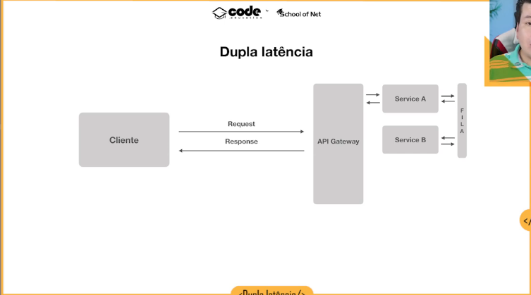

# Comunicação entre microserviços

Microserviços podem se consultar de forma síncrona ou assíncrona.

## Síncrona

    /* Service A */ ---> Request ---> /* Service B */
                (recebe um aguardando)
                    <--- Response -->

## Assíncrona

    /* Service A */ --> Request --> /* Mensageria */ --> /* Service B */

O sistema de fila aguarda o serviço voltar a funcionar para entregar novamente a mensagem.

# Exemplo de RabbitMQ

**Message Broker** - intermediário entre mensagens (meio de campo).
**AMQP** - Advanced Message Queuing Protocol
**Três Conceitos**
    1. Producer - dispara a solicitação
    2. Broker - Intermediário
    3. Consumers - recebe a solicitação
**Desacoplamento entre serviços** - Não precisa saber do outro microsserviço, apenas enviar a mensagem.
**Rápido e Poderoso** - outros sistemas: Kafka / Amazon 
**Padrão de Mercado**

    /* Producer */ --> | Exchange | --> | Queue | --> /* Consumer */
                                     \  | Queue | --> /* Consumer */
                                     \  | Queue | --> /* Consumer */

                 routing key         binding key

                 Fanout (mensagem encaminhada para todas as filas)
                 Direct (rounting key = binding key)

# Dupla Latência

Os caminhos em Microserviços são muito mais longos e demorados.

É preciso medir bem qual a vantagem de usar fila ou não usar fila.

É imperativo que se monitere e se faça os cálculos para verificar as demoras das requisições.

# Backend for Frontend

**BFF - Backend for Frontend** - Diferencia as requisições para o Backend de acordo com o frontend (cliente)

!(../imagens/arquitetura_03_comunicacao_single-api.jpg)

_Backend não diferencia as informações pelo frontend_

!(../imagens/arquitetura_03_comunicacao_bff-overview.jpg)

_Backend de acordo com o frontend_

Camadas que abstraem todas as chamadas para exibir apenas os resultados que precisam naquele cliente. Filtra
os resultados, mas pega da mesma API e só faz o filtro.