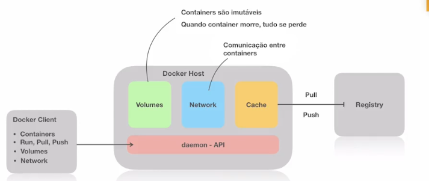

# Introdução

## O que são containers

> Um container é um padrão de unidade de software que empacota código e todas
> as dependências de uma aplicação fazendo com que a mesma seja executada
> rapidamente de forma confiável de um ambiente computacional para outro.

## Como funciona os Containers?

### Namespaces

        SISTEMA OPERACIONAL

    |--> Namespaces = isola os processos
    |
    |   Processo Pai Container 1
    |       Processo filho container 1
    |       Processo filho container 1
    |
    P   P   P   P   P   P   P
        PROCESSOS

* Pid
* User
* Network
* File system

### Cgroups

    SISTEMA OPERACIONAL

    |--> Cgroups = Controla os recursos compucionais
    |
    |   memory = 500mb
    |       
    |   cpu_shares = 512
    |
    |
    P   P   P   P   P   P   P
    PROCESSOS

### File System

    SISTEMA OPERACIONAL

    |--> File System = OFS (Overlay File System)
    |
    |   /*******************/   /*******************/
    |   |   MyApp:v1 = 70MB |   | MyApp:v2 = 70MB   |
    |   |   Dep1 = 200MB    |   |                   | dependencias já contempladas
    |   |   Dep2 = 200MB    |   |                   | no sistema v1
    |   /*******************/   /*******************/
    P   P   P   P   P   P   P
    PROCESSOS

## Imagens

    MyAppImage:v1

            MyApp:v1
             |
      Bash ssh.d   
        |   |
        Ubuntu (caso haja um pedaço quebrado, o rebuild conserta apenas a camada)
            |
        Scratch

## Dockerfile

Arquivo declarativo de como a imagem vai fazer build. A imagem deve partir de
uma imagem existente, mesmo que seja vazio.

    FROM: ImageName (imagem de partida)
    RUN: Comandos ex: apt-get install
    EXPOSE: 8000

## Como funciona os Containers

    SISTEMA OPERACIONAL

    |--> Namespaces     = isola os processos
    |
    |--> Cgroups        = controla os recursos
    |
    |--> File Sistem    = OFS (Overlay File System)
    |
    P   P   P   P   P   P   P
    PROCESSOS

Dentro de um Processo:

    Dockerfile
        FROM: ImageName (imagem de partida)
        RUN: Comandos ex: apt-get install
        EXPOSE: 8000

                    |
                    |       (build)
                    \/

    /*****************************/
    |                             |
    |           image             |
    |       estado imutável       |
    |                             |
    |-----------------------------|
    |   camada de Read / Write    |
    /*****************************/

Duas formas de conseguir gerar imagens: através do Dockerfile ou de um container
que está rodando e dar um commit para gerar uma nova imagem com o que foi alterado
para uma versão 2.

    /*****************************/                 /*****************************/
    |                             |                 |                             |
    |           Image             |                 |           Image:v2          |
    |       estado imutável       | --> commit -->  |       estado imutável       |
    |                             | (preserva o que |                             |
    |-----------------------------|  foi escrito no |-----------------------------|
    |   camada de Read / Write    |  Read / Write   |   camada de Read / Write    |
    /*****************************/                 /*****************************/

Onde ficam as images? Dentro do IMAGE REGISTRY.

                                                    /************************
    Dockerfile                              (pull)  | IMAGME REGISTRY       |
        FROM: ImageName (imagem de partida) --------|->  ImageName          |
        RUN: Comandos ex: apt-get install           |    IMAGE Y            |
        EXPOSE: 8000                                |    IMAGE X            |
                                                    /***********************/

    /*****************************/                 /***********************/
    |                             |                 | IMAGME REGISTRY       |
    |         ImageName:v2        |                 |                       |
    |       estado imutável       | ---> push ------|-> ImageName:v2        |
    |                             |                 |   ImageName           |
    |-----------------------------|                 |   IMAGE X             |
    |   camada de Read / Write    |                 |   IMAGE Y             |
    /*****************************/                 /***********************/

### Docker Host

Integração de _Namespaces, Cgroups e OFS_ dentro de uma mesma solução.

**daemom API**: fica rodando na máquina servindo os comandos;
**Docker Client**: faz as chamdas na API (rodar containers, run, pull, push);
**Cache**: Salva as imagens para não fazer download novamente;
**Volumes**: faz a persistência de dados dos containers;
**Network**: Garante as comunicações entre os containers;

